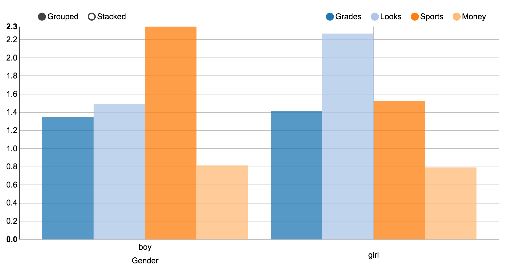
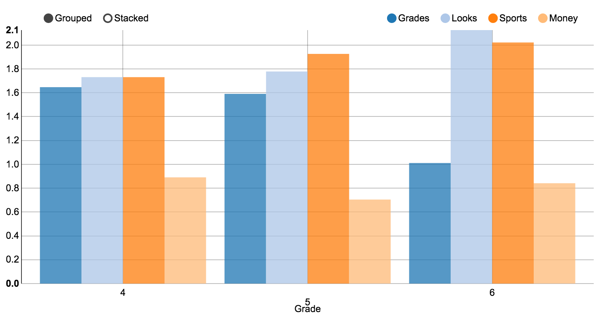

<style type='text/css'>
img {
max-height: 400px;
max-width: 800px;
}
</style>

## Introduction

* How do kids imagine getiing popular?
* Does age, race, grades or gender matter?
* Analysis of the DASL <a href="http://lib.stat.cmu.edu/DASL/Datafiles/PopularKids.html">Popular Kids</a> data set

---

## The data set

```r
summary(read.csv("kids.csv")[,c("Gender", "Race", "Age", "Grade")])
```

```
##   Gender       Race          Age            Grade      
##  boy :227   Other: 36   Min.   : 7.00   Min.   :4.000  
##  girl:251   White:442   1st Qu.:10.00   1st Qu.:5.000  
##                         Median :11.00   Median :5.000  
##                         Mean   :10.42   Mean   :5.134  
##                         3rd Qu.:11.00   3rd Qu.:6.000  
##                         Max.   :13.00   Max.   :6.000
```

---

## Gender, looks and sports

* Girls and boys seem equally interested in grades and and money.
* They differ on looks and sports, however



---

## The importance of grades

* Another interesting finding, is that the better the grades, the less emphasis the student will put on grades



---

## Thank you
... for your attention (i.e., grading this slide show)
